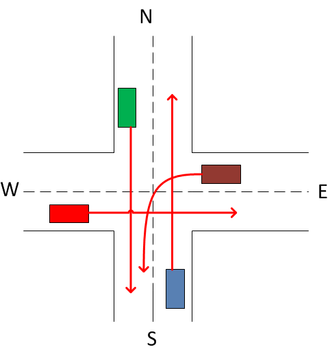

# MyStack Implementation in Java

## Overview

This repository contains the implementation of a crossroad model.

## Requirements

* Apache Maven 3.x+
* Java 19

## Build and Run

To build and run the project, follow these steps:

```bash
git clone https://github.com/timofeevAS/java_crossroad
cd java_crossroad/
mvn package
```

## Example Usage
To see work of Semaphore you need to execute:
```bash
mvn exec:java -Dexec.mainClass="org.example.Main"
```
